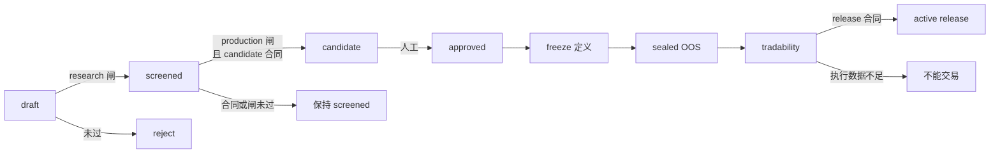
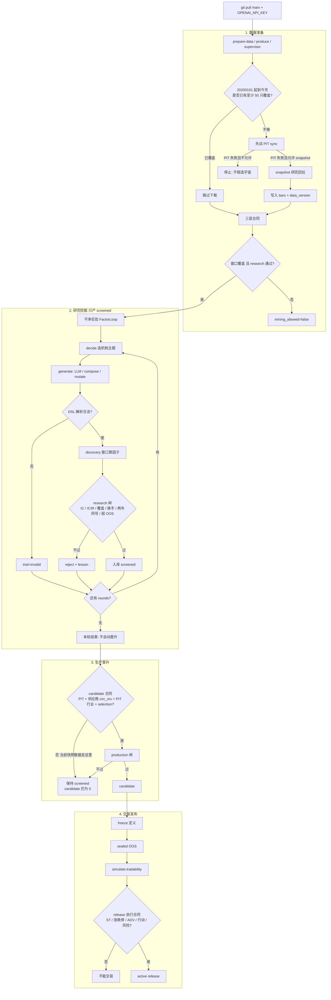
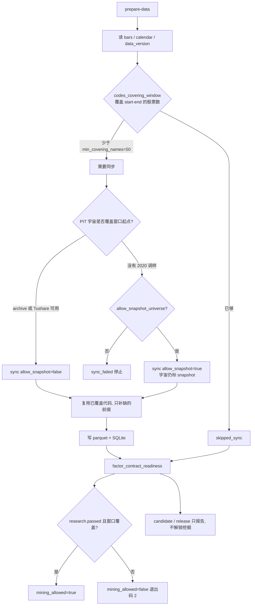
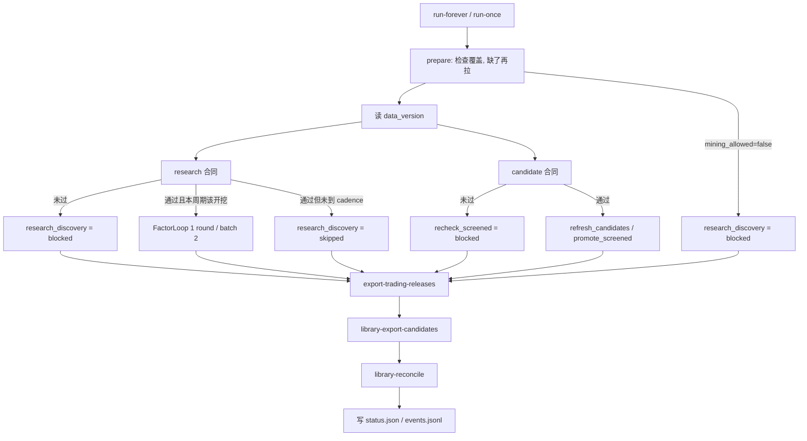

# qfactor

中证100（中证A100 / `000903.SH`）日频量价因子工厂。用 DSL 表达式生成因子，经研究闸 / 生产闸评估入库；LLM 只负责提案，过闸由解析器与数值闸门决定。

目标是维护**高质量价量因子库**，供后续多因子模块使用。

- `screened`：研究假说，可以当干净实验的父本，不能当生产库存。
- `candidate`：统计上可靠的生产因子。需要 PIT 成分、供应商流通市值、PIT 行业、selection 分区和选择偏差审计。
- `active release`：可交易发布。还要密封 OOS、订单级可交易性和完整执行/风险数据。

`candidate` 不是实盘许可。快照宇宙或估算市值上过研究闸，也不能升级成 candidate。

| 项 | 值 |
|---|---|
| 包名 | `qfactor` 0.1.0 |
| Python | ≥ 3.11 |
| 宇宙 | 中证100，日频，时区 `Asia/Shanghai` |
| 信号 | T 日算因子，T+1 交易；持有 / 前瞻收益默认 5 日 |
| 远程仓库 | https://github.com/CnOxx1/EvoQuantFactor.git |

---

## 目录结构

```
configs/                 项目、数据源、评估闸
src/qfactor/
  cli.py                 Typer CLI
  settings.py            配置加载
  agent/                 挖矿循环、实验账本、工厂 supervisor
  data/                  同步、成分、BaoStock / Tushare / archive
  dsl/                   表达式解析与求值
  eval/                  IC / OOS / 分层 / 相关 / 闸门
  factor/                因子注册、队列、库运营、release
  db/                    SQLite 双写
  api/                   FastAPI + Web UI
skills/mechanisms.yaml   八个机制族与提示骨架
factor_lib/factors/      每个因子一个目录（spec.yaml + factor.py + reports/）
tests/                   pytest
data/                    parquet / SQLite
```

安装：

```bash
python -m venv .venv
# Windows: .venv\Scripts\activate
pip install -e ".[dev]"
copy .env.example .env   # 填 OPENAI_API_KEY；PIT 成分另需 TUSHARE_TOKEN 或 archive
```

密钥只放在本地 `.env`，**不要提交**。挖矿需要 `OPENAI_API_KEY`。点时成分需要 `TUSHARE_TOKEN`，或经审计的 archive 文件。

```bash
set PYTHONPATH=src
python -m qfactor.cli --help
```

---

## 因子生命周期



| 状态 | 含义 | 用途 |
|---|---|---|
| `draft` | 刚生成或未过研究闸 | 不进 KEEP |
| `screened` | 过研究闸 | 研究堆；干净实验父本；**禁止当生产库存** |
| `candidate` | 过生产闸，且满足 candidate 数据合同 | 多因子研究输入（`tradable=false`） |
| `approved` | 人工确认后的 candidate | 当前库为 0 |
| `active release` | 密封 OOS + 可交易性 + 执行合同 | 唯一可供交易模块读取的输出 |
| `reject` / `deprecated` | 失败或下架 | 高相关 reject 不进父本 |

KEEP = `screened` + `candidate` + `approved`。  
USABLE = `candidate` + `approved`。  
冷启动：KEEP 父本少于 `production.cold_start.min_parents`（默认 8）时放开主题封锁与骨架冻结。

每个因子目录：

- `spec.yaml`：名称、状态、DSL `expression`、机制、假设、experiment / cohort
- `factor.py`：由表达式编译出的计算代码
- `reports/`：历次评估 JSON；`latest.json` 为最近一次

更细的流程图、合同挡板和服务器启动顺序见 [`docs/factor_production_flow.md`](docs/factor_production_flow.md)。

---

## 生产流程

挖矿前必须先经过数据准备：检查目标窗口覆盖、缺了再拉、再跑三层合同。`loop` 默认仍不下载；`prepare-data` / `produce` / supervisor 会走这个门。窗口没覆盖或 research 合同没过，就不能调用 LLM。缺哪一层证据，就停在哪一层，不会为了出因子而降门槛。

### 总览：四段门闩



当前快照成分 + 估算市值只能走到第 2 段的 `screened`。第 3、4 段保持为 0 是预期的 fail-closed，不是故障。

### 数据准备在检查什么

`DataPrepareService` 对照 `data_prepare.start`（默认 `20200101`）看覆盖，不够才调用底层 `sync-data`。已有 2024–2026 切片**不会**被当成 2020 年起的完整窗口。



直接 `loop`（不加 `--prepare-data`）仍可能用仓库里的两年切片开挖，因为当前 discovery 窗口就在 `20240102–20251231`。服务器上一键启动：

```bash
scripts/start_factory.sh              # pull main → prepare-data → 后台 supervisor
scripts/start_factory.sh produce      # 一次干净 produce
scripts/start_factory.sh prepare      # 只检查/补数据
scripts/start_factory.sh status
scripts/start_factory.sh stop
```

窗口不够时脚本会停住，不会开挖。也可以手工：

```bash
qfactor prepare-data
qfactor produce --rounds 5 --batch-size 8 --gate research
# 或
qfactor loop --prepare-data --rounds 5 --batch-size 8 --gate research --clean-experiment
```

### 工厂 supervisor 一个周期

supervisor **不会**每个周期重下行情。启动时 prepare；之后窗口完整则只检查。discovery 默认每 12 个周期一次。



---

## 分层数据合同

研究、candidate、交易 release 用不同证据，缺哪一层就停在哪一层，不降门槛。

```mermaid
flowchart LR
    subgraph research["research 才能开挖"]
        R1[日行情 has_bars]
        R2[discovery 分区已配置]
        R3[discovery 落在已同步范围内]
    end
    subgraph candidate["candidate 才能晋升生产因子"]
        C1[universe_mode = pit]
        C2[供应商 circ_mv]
        C3[PIT 行业]
        C4[selection 分区]
        C5[选择偏差审计]
        C6[独立观测 >= 60]
        C7[至少 3 年同号]
    end
    subgraph release["release 才能交易"]
        L1[ST / 停牌 / 涨跌停]
        L2[ADV / 公司行动]
        L3[风险暴露]
        L4[密封 OOS + 可交易账本]
    end
    research --> candidate --> release
```



| 层 | 最低要求 | 通过后可以做什么 |
|---|---|---|
| research | 日行情 + 已配置 discovery 分区 | 生成 / 评估 `screened` |
| candidate | PIT 成分、供应商 `circ_mv`、PIT 行业、selection 分区、选择偏差审计、独立观测 ≥ 60、至少 3 年同号 | 导出给非交易多因子模块 |
| release | ST / 停牌 / 涨跌停 / ADV / 公司行动 / 风险暴露覆盖达标，且密封 OOS + 可交易性通过 | `export-trading-releases` |

```bash
qfactor data-contract-readiness
qfactor library-cohorts
qfactor library-export-candidates
qfactor export-trading-releases
```

当前仓库默认是**快照成分 + 估算流通市值**。这只够 research。`candidate = 0` 和 `n_active = 0` 是预期的 fail-closed 结果。

优化顺序是：先停止假残差 IC，再补 PIT / 供应商文件，最后才扩 discovery 窗口。不要放宽闸门，也不要先改分区再拉数。细节见 `docs/factor_production_flow.md` 第 7 节。

---

## 数据

默认 SQLite：`data/qfactor.sqlite3`。`sync-data` / 因子入库会双写数据库；计算优先读 DB，失败再回退 Parquet。

| 用途 | 来源 | 说明 |
|---|---|---|
| 点时成分 | Tushare 或 archive `csi100_members.parquet` | `universe_policy.mode: pit`；缺历史调样不能假装 PIT |
| 研究行情 | BaoStock | 日 K、换手、`isST` / `tradestatus`、静态行业 |
| 流通市值 | 供应商 `daily_basic` | 估算 `amount/turnover` 只用于研究，不能当 candidate |
| 执行 / 风险 | archive | ST、涨跌停、ADV、公司行动、PIT 行业、风险暴露 |
| 最新成分 xls | 中证官网 | 仅 snapshot / 研究回拉名单 |

`mode: pit` 且没有 token、也没有覆盖窗口起点的 archive 时，同步会失败，而不会把今日名单盖满历史。磁盘上若仍是 snapshot，评估数字不能当 PIT 结论。

研究层可以把行情拉到 2020–2026，但必须显式声明这是快照回拉：

```bash
python -m qfactor.cli db-init
python -m qfactor.cli db-status

# 官方调样（缺半年工作簿会停止回溯，不会跨年拼接）
qfactor fetch-archive-universe
qfactor validate-archive

# 有 PIT archive 时
qfactor sync-universe --start 20200101 --end 20260815
qfactor sync-data --start 20200101 --end 20260815 --source baostock

# 没有覆盖 2020 的 PIT 时：只拉研究行情，宇宙仍标 snapshot
qfactor sync-data --start 20200101 --end 20260815 --source baostock --allow-snapshot-universe
qfactor data-contract-readiness

# 推荐：检查覆盖 → 缺了再拉 → 再看合同。窗口不够或 research 未过则退出码 2
qfactor prepare-data
```

已有 2024–2026 切片不会被当成 2020 年起的完整覆盖；缺前缀的代码会重新下载。新数据版本写入后，才能把 discovery 扩到 `20200102–20251231`。2026 行情可以入库，但不进入 discovery。

表：行情 `daily_bars`、成分 `universe_members`、行业 `industry_map`、因子 `factors` / `factor_reports`、任务 `jobs`、checkpoint `loop_checkpoints`、实验账本。

---

## 评估闸

配置：`configs/eval_thresholds.yaml`。交易滞后 1 日、前瞻 5 日、分层 5 档、成本 10bp。研究默认 discovery 窗口 `20240102–20251231`；生产闸还要求 selection 分区，密封验收只读 sealed 分区。

**不要放松 production / release 闸。** 不要加大 `llm_ratio` / `llm_batch_size`，不要把冷启动阈值开到 KEEP 接近全库。

### research（挖矿 → screened）

- `|Rank IC| ≥ 0.01`，覆盖 ≥ 0.60，相关 ≤ 0.85
- 年化 ICIR ≥ 1.0；两年同号即可
- 要求 OOS，但门槛弱（OOS IC 均值 ≥ 0）
- 不强制成本后多空为正、不强制残差 IC
- 快照宇宙可以过这一层

### production（screened → candidate）

- `|Rank IC| ≥ 0.02`，覆盖 ≥ 0.70，相关 ≤ 0.70
- Newey-West ICIR：全样本门槛与 holdout `min_holdout_icir: 0.07`
- 残差 IC：`min_resid_ic_mean: 0.01`，残差 NW ICIR ≥ 0.07
- 分层单调 ≥ 0.75；成本后多空为正
- `freeze_sign`：训练窗与 holdout 同号，且 holdout IC ≥ `min_oos_ic_mean`
- **至少 3 年同号**；近期 IC 为正；日换手 ≤ 1.20
- PIT 宇宙、供应商 `circ_mv`、PIT 行业、selection 分区、选择偏差审计

### release（candidate → active）

- 证券状态 / 涨跌停覆盖 ≥ 98%
- ADV 20 日 / 公司行动 / PIT 行业 / 风险暴露达到合同阈值
- 定义已冻结，密封 OOS 通过，订单账本可交易性通过

后续非交易多因子研究只能读取 `library-export-candidates`，且 `tradable=false`。交易模块只能读取 `export-trading-releases` 的 `active` release。

```bash
python -m qfactor.cli eval-factor NAME --gate research
python -m qfactor.cli library-reeval-screened
python -m qfactor.cli library-refresh-production
python -m qfactor.cli library-promote NAME --gate production
python -m qfactor.cli library-export-candidates
```

---

## 挖矿循环

LangGraph：`decide → generate → review_validate → persist`。循环只产 `screened`，**不会**在图结束时自动晋升 candidate。晋升用 `library-reeval-screened` / `library-promote`，并且仍受 candidate 合同约束。

默认 `experiment.clean_discovery_default: true`。干净实验忽略旧 checkpoint、lesson、额外模板和 legacy snapshot 父本，只使用固定 DSL seed 以及本次 experiment 新产生的 screened。

```bash
scripts/start_factory.sh
scripts/start_factory.sh produce
python -m qfactor.cli prepare-data
python -m qfactor.cli produce --rounds 5 --batch-size 8 --gate research
python -m qfactor.cli loop --prepare-data --rounds 5 --batch-size 8 --gate research --clean-experiment
python -m qfactor.agent.supervisor run-forever --start-cycle 12
```

### 生成槽位（`llm_slot_plan`）

目录仍厚（未用 compose 模板多）时以 compose 为主。目录空时固定：

| 槽 | 空目录 |
|---|---|
| LLM fresh | 3（假设 → 编译，禁止已有 catalog 骨架） |
| AST 交叉 | ≥ 3 |
| LLM mutate | 1 |
| compose | 剩余 |

失败**不会**回退成 compose 灌近亲。因子名用落地 `mechanism`，不用当轮 theme。

### 机制封锁与父本

已有 USABLE 的机制不再当主题。干净实验里，legacy snapshot 因子不能当父本。热库交叉父本按未封锁机制均分 `parent_top_screened`，避免单一机制占满。

### 机制族

`skills/mechanisms.yaml`：reversal、momentum、volatility、liquidity、overnight、amplitude、volume_price、shadow。

---

## CLI 一览

| 命令 | 作用 |
|---|---|
| `scripts/start_factory.sh` | 服务器启动：pull → prepare-data → factory / produce |
| `prepare-data` / `produce` | 挖矿前检查覆盖、缺了再拉、过 research 合同才开挖 |
| `sync-data` / `sync-universe` / `data-status` / `data-contract-readiness` | 行情、成分、分层合同 |
| `fetch-archive-universe` / `ingest-archive` / `validate-archive` | 官方/供应商归档 |
| `install-seeds` | 写入种子因子 |
| `list-factors` / `eval-factor` / `library-cohorts` | 单因子与队列 |
| `mine` / `loop` | 挖矿（需 API key；`--prepare-data` 先过数据门；`--clean-experiment` 隔离 legacy） |
| `library-archive` / `library-demote-corr` / `library-cap-usable` | 归档、高相关降权、每机制 1 条 candidate |
| `library-reeval-screened` | screened 上生产闸（仍受 candidate 合同约束） |
| `library-refresh-production` | 重打 candidate |
| `library-promote` / `library-demote` / `library-reconcile` | 升降级与一致性检查 |
| `library-export-candidates` | 导出 `tradable=false` 的统计候选 |
| `freeze-factor` / `sealed-accept` / `simulate-tradability` / `publish-release` | 验收与发布 |
| `export-trading-releases` | 导出 `active` release |
| `db-init` / `db-import` / `db-status` | SQLite |
| `serve` | Web UI `http://127.0.0.1:8000/ui/{sync,loop,factors}` |
| `show-config` | 打印根路径与宇宙 |

---

## 配置要点

`configs/project.yaml`：

- `universe_policy.mode`: `pit`（默认）\| `freeze_start` \| `snapshot`
- `defaults.trade_lag: 1`，`adj_type: qfq`
- `experiment.clean_discovery_default: true`，`bootstrap_research_only: true`
- `production.llm.llm_ratio: 0.45`，`llm_batch_size: 4`，`llm_review_ratio: 0`（LLM 不否决）
- `llm_decide_theme: false`（本地轮转主题，省一次 LLM）
- `diversity.max_per_skeleton: 2`，`max_corr_ban: 0.90`
- `cold_start.min_parents: 8`，`prior_update_every: 20`，`cheap_ic_min: 0.008`

`configs/data_sources.yaml`：指数代码 `000903`；`providers.*.auto` 在无 Tushare token 且 archive 文件存在时解析为 `archive`。

`configs/eval_thresholds.yaml`：研究 discovery 默认 `20240102–20251231`；selection / sealed 未配置。生产要求 3 年稳定。

---

## 当前库

截至合并到 `main` 的研究状态：

- `candidate` / `approved` / `active release` 均为 **0**
- 已有 `screened` 研究库存；旧快照因子标为 `legacy_snapshot_research`，不能当干净实验父本
- 干净实验可以继续生产 `screened`；在 PIT、供应商市值和 selection 分区补齐之前，不会出现 candidate

这是合同保护，不是应通过放宽阈值解决的问题。补齐长 PIT 历史后必须创建**新 data version 和新分区**，不能把旧 bootstrap 报告升级。

---

## 测试

```bash
python -m pytest tests -q
```

覆盖 DSL、闸门、宇宙、归档、分层合同、干净实验、实验账本、生成槽位和多样性。不要为了过测试而放宽 production / release 阈值。

---

## 已知限制

1. **PIT**：没有覆盖窗口起点的历史调样和供应商 `circ_mv` 时，不能把当前 IC 说成点时中证100结果。
2. **candidate ≠ 实盘**：还要密封 OOS、可交易性和执行合同，才能成为 `active release`。
3. **快照回拉 2020–2026**：只能补研究年份，不能把今日成分的历史当成 PIT。
4. **残差 IC**：静态行业和估算市值不能做中性化。缺 `industry_pit` 或供应商 `daily_basic` 时，评估应报告原始 IC，而不是假 residual。
5. **LLM 只提案**：不提高 `llm_ratio`、不加新 Agent、不用 LLM 否决过闸。
6. **运行产物**：`runs/loop_*`、SQLite `-wal/-shm`、`.env` 不入库。密钥用 `.env.example` 复制。

更细的数据合同见 `docs/production_data_contract.md`，研究质量控制见 `docs/research_quality_controls.md`，生产流程图见 `docs/factor_production_flow.md`。

---

## 生产级实验与 release

```bash
# 行情、discovery 分区和 LLM key 通过后允许 research discovery
qfactor loop --rounds 5 --batch-size 8 --gate research --clean-experiment
qfactor freeze-factor NAME
qfactor sealed-accept NAME --start YYYYMMDD --end YYYYMMDD
qfactor simulate-tradability NAME
qfactor publish-release NAME
qfactor export-trading-releases
```

`simulate-tradability` 使用非重叠账本：T 日信号、T+1 开盘执行、固定持有期、开盘涨跌停/停牌掩码、成本和 ADV 参与率。若缺少点时 ST、完整涨跌停或容量输入，它会写出 `tradability_blocked`，而不是产生通过标签。

> 当 `candidate = 0` 或 `n_active = 0` 时，正确的动作是补齐 PIT / 密封样本 / 订单级约束，而不是放宽门槛或增加 LLM 搜索量。
