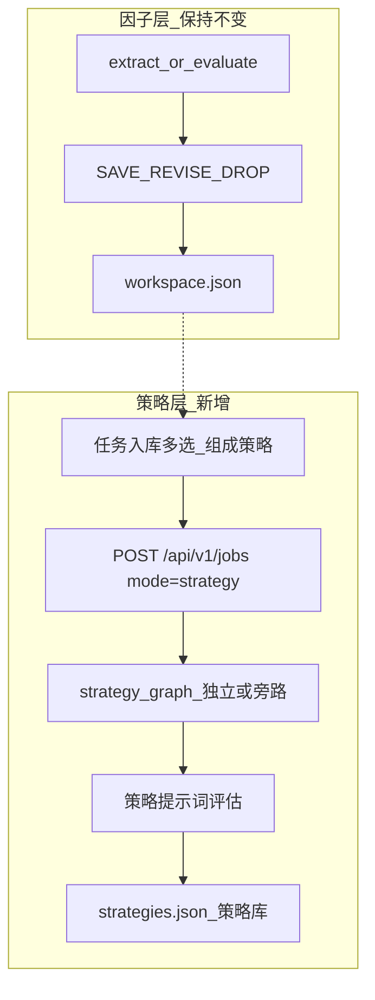

# 多因子策略层设计（MVP 实现计划）

> 状态：**规划文档**（尚未编码）。  
> 约束：**不改**现有单因子 LangGraph 门禁（`decide_action` / Step2 六角色职责不变）。  
> 前置阅读：[因子优化流程设计](../因子优化流程设计.md) §0、[更新记录](../更新记录.md)。
>
> **归档说明**：本文为未编码规划，不代表现网能力。

## 1. 目标

在因子层产出（任务入库 SAVE）之上，增加独立的 **策略层**：

1. 用户从任务入库勾选 **多个** 已过线因子；
2. 指定合成规则（MVP 默认等权）；
3. 跑 **策略级** 评估任务（`mode=strategy`），结果写入策略库；
4. 策略失败 **不** DROP 成分因子，不污染 `workspace` / `dropped`。

## 2. 非目标（MVP 不做）

- 真实行情回测 / IC·IR 计算引擎（可后续接 MCP 或外部回测）
- 改写 Alpha101 JSON 或单因子 `SAVE` 门槛
- 把策略评估塞进现有 `step2_r*.json` 单因子提示词
- 自动正交化 / 机器学习加权（可作为 V2）

## 3. 架构



推荐实现方式（二选一，MVP 取 **旁路 Job**）：

| 方案 | 说明 | MVP 选择 |
|------|------|----------|
| A. 旁路 Job | 复用 jobs 队列与步骤回放，`meta.mode=strategy`，**新图或新节点集** | **采用** |
| B. 独立 `/strategies` 资源 | 另起 CRUD + 评估 worker | 可作 V1.1 |

**禁止**：在现有 `node_review_fanout` / `node_code_gate` 上对「因子列表当组合」复用单因子门槛。

## 4. 数据模型

### 4.1 策略定义（请求 / 存储）

```json
{
  "strategy_id": "stg_xxx",
  "name": "动量+估值等权",
  "compose": {
    "method": "equal_weight",
    "weights": null
  },
  "members": [
    {
      "factor_id": "job_abc:1",
      "origin_factor_id": "1",
      "name_zh": "…",
      "formula_or_rule": "…",
      "final_score": 82.0
    }
  ],
  "status": "DRAFT | PASSED | REJECTED",
  "evaluation": {
    "score": null,
    "summary": null,
    "issues": [],
    "suggestions": []
  },
  "source_job_id": "job_strategy_xxx",
  "updated_at": "ISO-8601"
}
```

- 文件：`data/factor_library/strategies.json`（或 `data/strategies/strategies.json`）
- pack 暴露：`GET /api/v1/factor-library/packs` 增加 `strategies`（可选）或独立 `GET /api/v1/strategies`

### 4.2 Job meta（策略任务）

```json
{
  "mode": "strategy",
  "strategy_draft": {
    "name": "…",
    "compose": { "method": "equal_weight" },
    "members": [ /* SeedFactorIn 兼容字段 + library factor_id */ ]
  }
}
```

成员建议 **仅允许** 来自 `workspace`（SAVE）。淘汰库因子需先「优化过线」再入组（产品规则写死，避免脏组合）。

## 5. 流水线（MVP）

独立短图（不要复用 revise 回灌单因子）：

```text
START → strategy_ingest
     → strategy_evaluate   # 1 次或少量 LLM JSON 调用
     → strategy_persist    # 写 strategies.json + job result
     → END
```

### 5.1 strategy_ingest

- 校验 `members.length >= 2`
- 校验每个 member 在 workspace 中存在（或请求体自带完整公式）
- 生成 stub「策略说明书」文本（因子清单 + 合成方法），供步骤回放

### 5.2 strategy_evaluate

新提示词：`prompts/strategy_evaluate.json`（**新建**，不改 `step2_r*`）

评估维度（LLM 结构化输出，代码可再加硬规则）：

| 维度 | 说明 |
|------|------|
| 冗余 / 相关 | 公式是否高度同质（同输入同变换） |
| 可实现性 | 合成后频率、字段是否一致 |
| 可解释性 | 权重与经济逻辑是否说得清 |
| 风险集中 | 是否全押同一风格/行业假设 |
| 建议 | 删因子 / 调权 / 拆成多策略 |

硬规则示例（代码）：

- `len(members) < 2` → 直接 REJECT
- `method=weighted` 且权重和 ≠ 1（容差）→ REJECT
- 成员 `formula_or_rule` 为空 → REJECT

MVP **不做** 数值回测分数门槛；`status` 由 LLM 建议 + 人工确认，或简单 `score >= 70 → PASSED`。

### 5.3 strategy_persist

- 写入 `strategies.json`（按 `strategy_id` upsert）
- `job.result` 含策略快照与评估明细
- **禁止** 调用 `upsert_job_factors_to_workspace` / `dropped`

## 6. API 草案

| 方法 | 路径 | 说明 |
|------|------|------|
| POST | `/api/v1/jobs` | `mode=strategy` + `strategy` 体（或 `factors`+`compose`） |
| GET | `/api/v1/strategies` | 策略列表 |
| GET | `/api/v1/strategies/{id}` | 策略详情 |
| POST | `/api/v1/strategies/{id}/rerun` | 可选：再评估 |

创建示例：

```json
{
  "mode": "strategy",
  "title": "组成策略 · 动量估值",
  "strategy": {
    "name": "动量+估值等权",
    "compose": { "method": "equal_weight" },
    "member_ids": ["job_aaa:1", "job_aaa:2"]
  }
}
```

服务端从 workspace 解析 `member_ids` → 填满 `members`。

## 7. 前端 MVP

- [FactorsView.vue](../frontend/src/views/FactorsView.vue)「任务入库」Tab：
  - 多选 ≥2 时启用按钮 **「组成策略」**（与「优化因子」并列）
  - 弹窗：策略名称、合成方式（等权 / 自定义权重）
- 新页或 Tab：**策略库**（列表、状态、跳转评估任务）
- 路由建议：`/strategies`、`/strategies/:id`

不在 Alpha101 / 淘汰库直接「组成策略」（产品默认）；需要时先优化入库。

## 8. 实现任务拆分（开发用）

| 序号 | 任务 | 主要路径 |
|------|------|----------|
| 1 | Schema：`StrategyCreate` / `ComposeSpec`；`JobCreate.mode` 扩展 `strategy` | `models/schemas.py` |
| 2 | `strategies` 读写服务 | `services/strategy_library.py`（新建） |
| 3 | 策略短图 + 节点 | `graph/strategy_*.py` 或 `nodes_strategy.py` |
| 4 | 提示词 `strategy_evaluate.json` + index | `prompts/` |
| 5 | 路由创建 / 列表 | `routes_jobs.py` / `routes_strategies.py` |
| 6 | 前端组成策略 + 策略库页 | `FactorsView.vue`、新 View |
| 7 | 文档：更新记录追加「策略层上线」；API 对接补章节 | `docs/` |
| 8 | 测试：成员不足拒绝；persist 不写 workspace | `tests/` |

## 9. 验收标准

- [ ] 单因子 extract/evaluate/门禁行为与上线前 **比特级语义一致**（回归现有测试）
- [ ] 从任务入库选 ≥2 个 SAVE 因子可创建 `mode=strategy` 任务并出步骤时间线
- [ ] 通过/驳回写入策略库；`workspace.json` / `dropped.json` 计数不变（因策略任务）
- [ ] 策略 REJECT 后，成分因子仍可单独「优化因子」

## 10. 演进（V2+）

- 加权 / 分层 / 正交提示 + 简单相关矩阵（若 MCP 提供因子值）
- 策略回测适配器（外部引擎）
- 策略 → 再拆因子回灌优化的工作流

## 11. 决策摘要

| 问题 | 决定 |
|------|------|
| 要不要改现有单因子流程？ | **不要** |
| 策略怎么做？ | 独立 `mode=strategy` + 策略库 |
| 成分从哪来？ | MVP 仅 `workspace` SAVE |
| 与 evaluate 勾选多因子的区别？ | evaluate=并行单因子评估；strategy=组合评估 |
