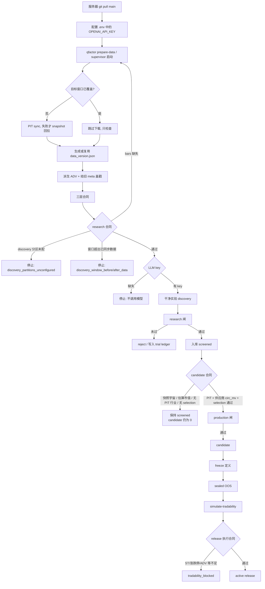
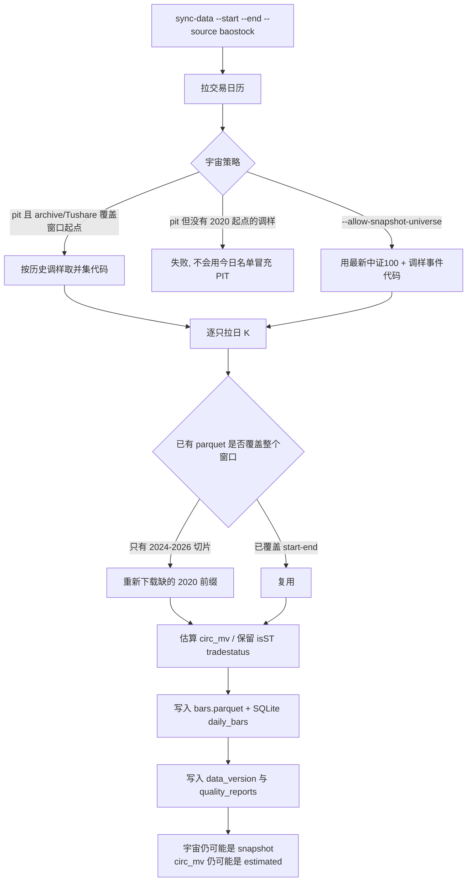
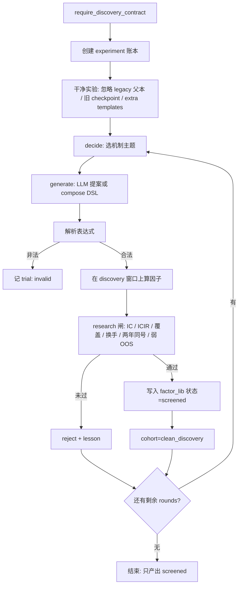
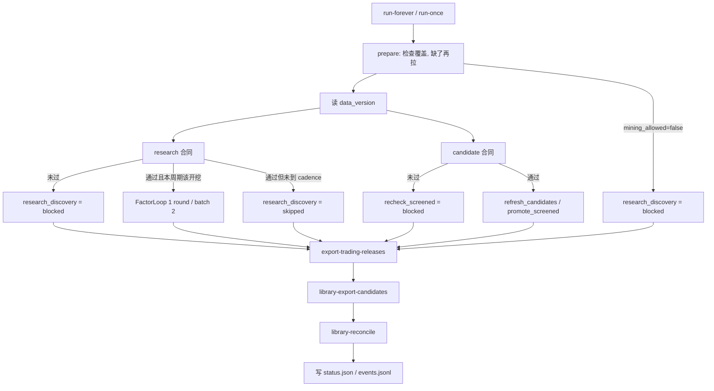

# 因子生产逻辑与服务器启动顺序

`loop` 默认仍不下载行情。生产前的获取、保持和检查由 `DataPrepareService`（`qfactor prepare-data` / `produce` / supervisor）负责：对照配置窗口检查覆盖，缺了再 `sync`，再跑三层合同。窗口没覆盖或 research 没过，就不能开挖。缺哪一层证据，就停在哪一层，不会为了出因子而降门槛。

## 1. 总流程



## 2. 数据同步在做什么

`qfactor sync-data` 仍是底层拉数命令。`prepare-data` 在窗口已覆盖时不会重下；supervisor 只在启动或覆盖不完整时调用它。PIT 宇宙会先试；只有配置允许时才用 snapshot 做研究回拉，且不会把 snapshot 标成 PIT。



同步完成后才能谈“数据完整”。完整分三层，见下一节。

## 3. 合同检查：什么叫完整

`qfactor data-contract-readiness` 一次返回三层。`prepare-data` 会先看目标窗口覆盖，再复用这三层。`loop --prepare-data` / `produce` / supervisor 在调用 LLM 之前还要 `mining_allowed`。`loop` 本身仍会再跑 `require_discovery_contract`；晋升 candidate 前会再跑 `require_candidate_contract`。

```mermaid
flowchart LR
    subgraph research["research 合同 才能开挖"]
        R1[日行情 has_bars]
        R2[discovery_start / discovery_end 已配置]
        R3[discovery 窗口落在已同步数据范围内]
    end
    subgraph candidate["candidate 合同 才能晋升生产因子"]
        C1[universe_mode = pit]
        C2[供应商 circ_mv]
        C3[PIT 行业覆盖 >= 95%]
        C4[selection 分区已冻结]
        C5[选择偏差审计]
        C6[独立观测 >= 60]
        C7[至少 3 年同号]
    end
    subgraph release["release 合同 才能交易"]
        L1[ST / 停牌 / 涨跌停 >= 98%]
        L2[ADV / 公司行动]
        L3[风险暴露]
        L4[密封 OOS + 可交易账本]
    end
    research --> candidate --> release
```



快照成分 + 估算市值可以通过 research，**不能**通过 candidate。这是设计，不是故障。

## 4. 单次 discovery 怎么生产 screened

只有 research 合同通过后，`FactorLoop` / supervisor 才会进入这一段。



循环**不会**自动 `promote_screened`。supervisor 每个周期都会看 candidate 合同；不过就明确 `recheck_screened=blocked`。

## 5. 工厂 supervisor 一个周期



默认 `discovery_every=12`。`run-forever --start-cycle 12` 会在第 12 周期先挖一轮，之后每 12 个周期再挖。这只影响研究 discovery，不影响 candidate 挡板。

## 6. 服务器上必须按这个顺序

直接 `loop`（不加 `--prepare-data`）仍可能用仓库里的 2024–2026 切片开挖，因为当前 discovery 窗口就在这段数据里。`prepare-data` / `produce` / 默认 supervisor 会先对照 `data_prepare.start`（默认 `20200101`）检查覆盖，不够就拉，不够且拉失败就挡住 mining。

```bash
# 推荐：一条命令按顺序 pull → prepare-data → 启动工厂
scripts/start_factory.sh
scripts/start_factory.sh status
scripts/start_factory.sh stop

# 等价手工步骤
git fetch origin main && git checkout main && git pull origin main
.venv/bin/qfactor prepare-data
.venv/bin/qfactor data-contract-readiness
.venv/bin/qfactor produce --rounds 5 --batch-size 8 --gate research
# 或
.venv/bin/python -m qfactor.agent.supervisor run-forever --start-cycle 12
```

长历史进库并生成**新** `data_version` 之后，才能把 `eval.partitions.discovery_start` 改成 `20200102`。如果先改分区再拉数，`discovery_window_before_data` 会挡住 LLM，这是正确的。

2026 行情可以留在库里，但不要写进 discovery。candidate 在 PIT 成分、供应商市值和 selection 分区补齐之前必须保持为 0。

## 7. 三层优化：先诚实，再补证据，最后扩窗口

不要放宽闸门，也不要再开一轮只为了“多挖 screened”的 LLM。优化按这三层走，不能跳层。

### 第一层：代码诚实（本仓库即可）

`prepare-data` 在已有行情上会调用 `enrich_derived_evidence`：用已完成成交额填派生 `adv_20d`，并给旧 `data_version.json` 盖上 `universe_mode` / `circ_mv_source`。这**不会**把 snapshot 升成 PIT，也**不会**把估算市值升成供应商市值。

评估中性化只在 candidate 级证据上做：

- 行业残差只用日期对齐的 `industry_pit`。今日静态行业图会把当前分类灌进历史，造成前视。
- 市值残差只在 `circ_mv_source` 以 `_daily_basic` 结尾时做。`amount/turnover` 估算市值上的 residual IC 不是生产声明。
- `eval.neutralize_require_vendor_circ_mv` 默认 `true`。

这一层只停止假残差。`candidate` 仍为 0。

### 第二层：供应商 / archive 证据（在你的服务器上）

把覆盖窗口起点的文件放进 `data/raw/providers/`，或配置 `TUSHARE_TOKEN`：

| 文件 | 用途 |
|---|---|
| `csi100_members.parquet` | 点时中证100调样 |
| `daily_basic.parquet` | 供应商流通市值 |
| `industry_history.parquet` | 点时行业 |
| `security_status.parquet` | ST / 停牌 / 涨跌停 |
| `corporate_actions.parquet` | 公司行动 |

不要把中证官网最新快照和历史 xls 在缺口大于 240 个交易日时拼接成假 PIT。官方 archive 目前只有最新快照时，重建必须停，而不是用今日名单盖满 2020。

拉数命令仍是：

```bash
git fetch origin main && git checkout main && git pull origin main
scripts/start_factory.sh
# 或
.venv/bin/qfactor prepare-data
```

不要在没有 token / archive 的环境里再开一小时 BaoStock 下载指望它变成 candidate。

### 第三层：新 data_version 之后再扩 discovery

只有第二层写出**新** `data_version`，并且 `universe_mode=pit`、`circ_mv_source` 为供应商 `*_daily_basic` 之后，才改：

- `eval.partitions.discovery_start` → `20200102`（不要写进 2026）
- 配置并冻结 `selection_start` / `selection_end`
- 对已有 screened 做 `library-reeval-screened`，让真正过生产闸的因子进入 candidate

旧 bootstrap 报告不能升级。新宇宙和新市值来源必须重算。
