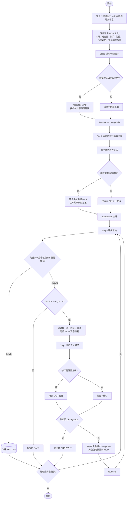
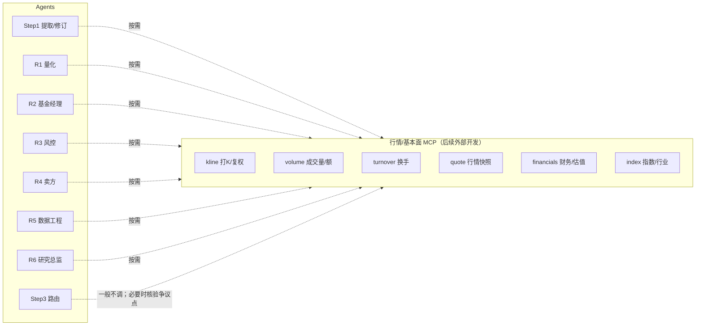
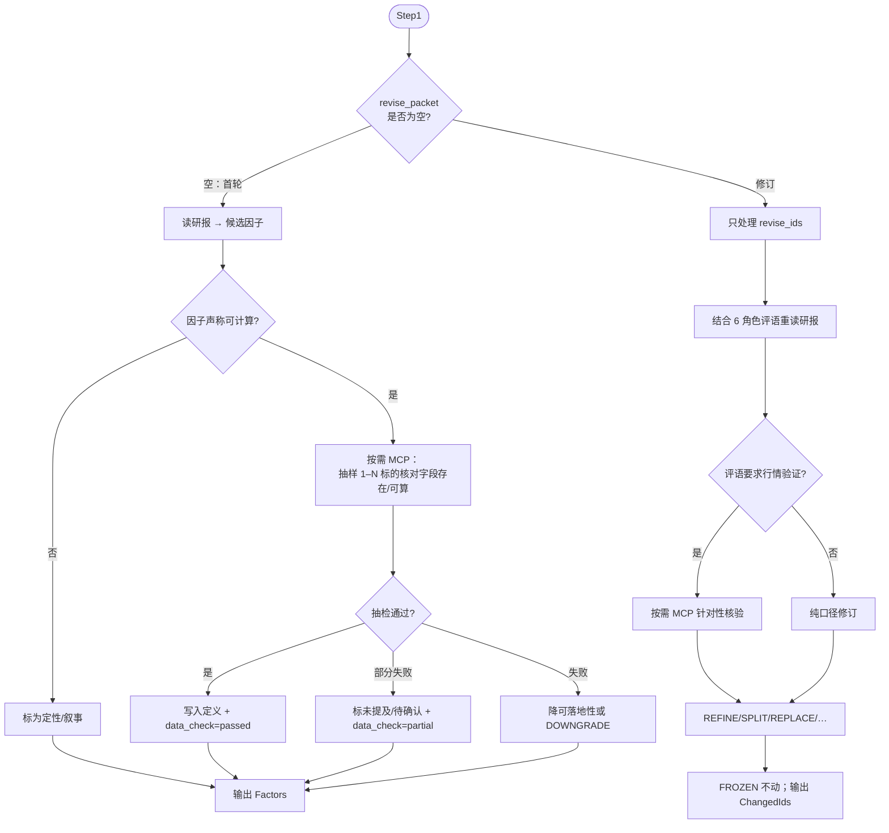
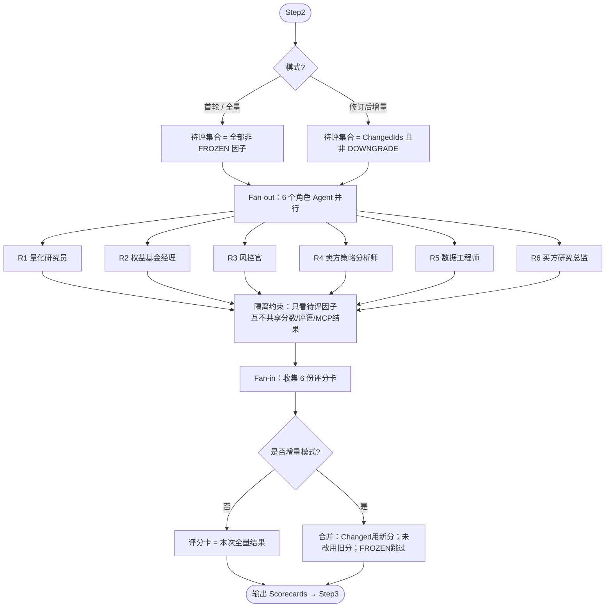
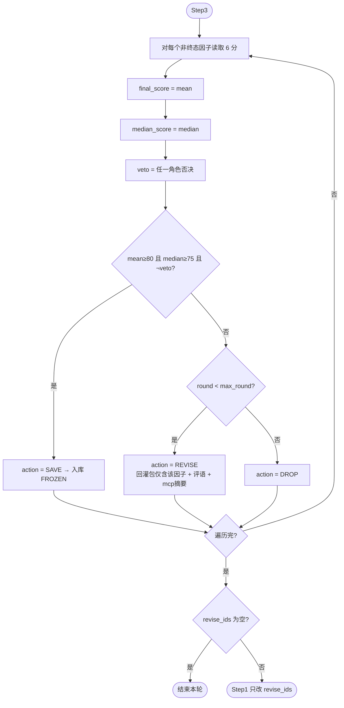
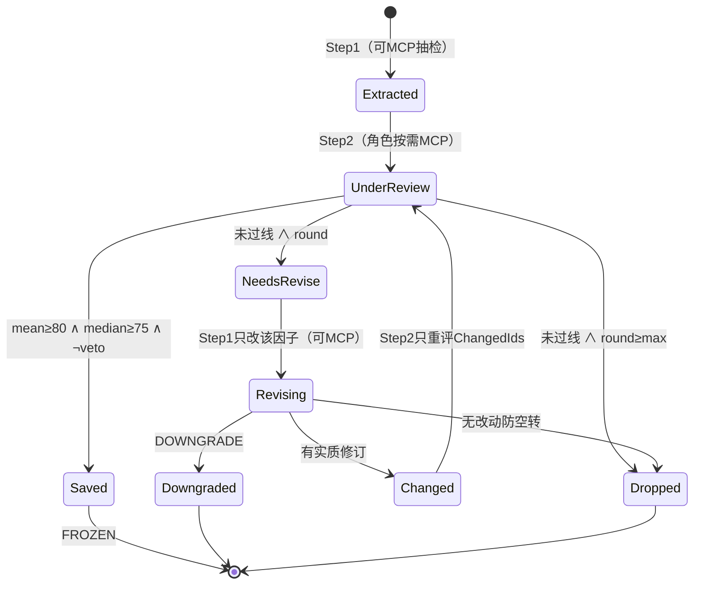
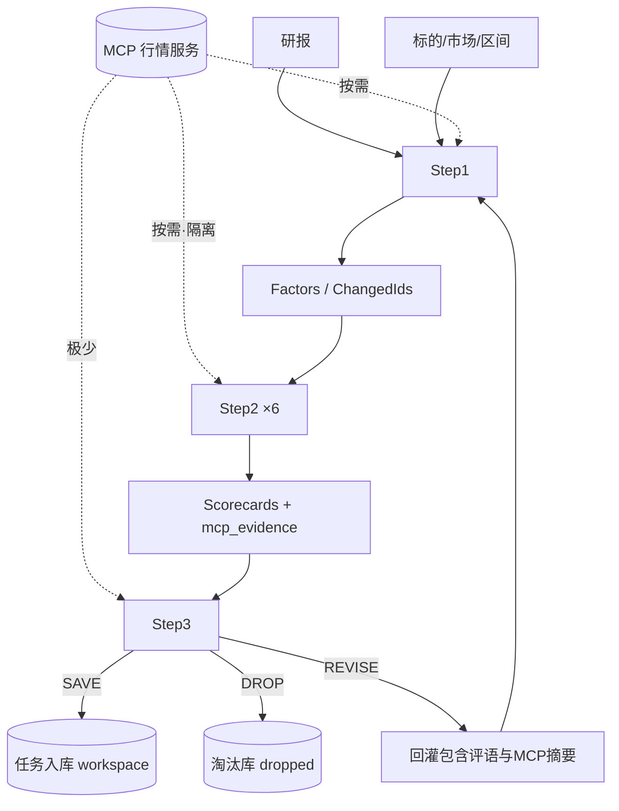

# 金融研报因子提取与多角色评审流程设计

## 1. 目标

从金融研报中提取可量化因子，经 **6 个金融角色并行隔离评审** 后，按门槛入库；未过线因子携带评审意见回灌提取 Agent 修订，并仅对改动因子增量重评。各 Agent 除研报外，可按需调用外部 MCP（K 线、成交量等）做验证，不得臆造行情。

> **边界**：本文描述的是 **因子层（单因子质量门禁）**。多因子组成策略属于独立的策略层，不改写本文门禁与六角色职责；见 [多因子策略层设计](./多因子策略层设计.md)、[更新记录 · 2026-08-03](./更新记录.md)。

## 2. 核心规则

| 规则项 | 约定 |
|--------|------|
| 保存门槛 | `mean ≥ 80` **且** `median ≥ 75` **且** `veto = false` |
| 均分 | 六角色加权总分的算术平均 |
| 中位数 | 六角色加权总分的中位数 |
| 一票否决 | 任一角色 `veto=true` → 不得 SAVE |
| Step1 修订范围 | **只改**未过线（REVISE）因子；已 SAVE 的 `FROZEN` 原样保留 |
| Step2 重评范围 | **只重评** `ChangedIds`；未改动因子沿用上轮分数 |
| 并行隔离 | 六角色独立会话；分数、评语、MCP 调用结果互不共享 |
| MCP | 按需调用；研报定定义，MCP 做验证/举例/证伪 |
| 最大轮次 | `max_round` 默认 `3`（含首次） |
| 防空转 | 修订后无实质 `ChangedIds` → 强制 DROP / 人工 |

## 3. 目录结构

```text
因子/
├── docs/
│   └── 因子提取评审流程设计.md          # 本文档
└── prompts/
    ├── _shared_mcp.json                 # MCP 调用共用约定
    ├── step1_extract.json               # Step1 提取/修订
    ├── step2_r1_quant.json              # R1 量化研究员
    ├── step2_r2_pm.json                 # R2 权益基金经理
    ├── step2_r3_risk.json               # R3 风控官
    ├── step2_r4_sellside.json           # R4 卖方策略分析师
    ├── step2_r5_data.json               # R5 数据工程师
    ├── step2_r6_head.json               # R6 买方研究总监
    └── step3_router.json                # Step3 路由裁决
```

## 4. 流程图

### 4.1 总览（含 MCP）



### 4.2 MCP 能力层



### 4.3 Step1：首次提取 vs 修订轮



### 4.4 Step2：并行隔离 + 增量重评



### 4.5 Step3：裁决与路由



### 4.6 单因子状态机



### 4.7 数据流



落盘说明（实现）：

- SAVE → `data/factor_library/workspace.json` + 任务结果 `factors`
- DROP（有公式）→ `data/factor_library/dropped.json` + 任务结果 `candidates`
- 公开 Alpha101 不被改写；详见 [更新记录](./更新记录.md)、[因子优化流程设计](../因子优化流程设计.md)
## 5. 编排伪代码

```text
saved = []
prev_scorecards = {}
factors = Step1(report, meta, revise_packet=None, frozen=saved)

for round in 1..max_round:
  to_review = all_non_frozen(factors) if round==1 or full \
              else factors.ChangedIds

  scorecards_new = parallel_isolated([
    R1, R2, R3, R4, R5, R6
  ], factors=to_review, mcp=on_demand)

  scorecards = merge(prev_scorecards, scorecards_new, changed=to_review)
  route = Step3(factors, scorecards, round, max_round)

  saved += route.SAVE   # FROZEN
  prev_scorecards = scorecards

  if route.REVISE is empty:
    break

  factors = Step1(
    report, meta,
    revise_packet=route.revise_packet,
    frozen=saved
  )

  if factors.ChangedIds is empty:
    force_drop(route.REVISE)  # 防空转
    break

persist(saved, route.DROP)
```

### 增量评分合并

```text
Scorecard[f] =
  新分  若 f ∈ ChangedIds
  旧分  若 f ∉ ChangedIds 且 f 非 FROZEN
  跳过  若 f ∈ {FROZEN, DOWNGRADE, DROP}
```

## 6. 保存判定公式

对因子 `f`，六个角色打分为 `s1, s2, s3, s4, s5, s6`：

```text
mean   = (s1 + s2 + s3 + s4 + s5 + s6) / 6
median = 六个分数排序后的中位数
veto   = 六个角色中是否存在任一 veto_i == true
```

**SAVE** 当且仅当同时满足：

```text
mean >= 80
AND median >= 75
AND veto == false
```

否则：

- 若 `round < max_round` → **REVISE**（回灌 Step1）
- 若 `round >= max_round` → **DROP**（淘汰 / 人工）

## 7. Agent 与提示词文件对照

| Agent ID | 名称 | 提示词文件 | 并行 | MCP |
|----------|------|------------|------|-----|
| step1 | 因子提取/修订 | `prompts/step1_extract.json` | 否 | 抽检/修订核验 |
| step2_r1 | 量化研究员 | `prompts/step2_r1_quant.json` | 是 | 公式/前视/可算性 |
| step2_r2 | 权益基金经理 | `prompts/step2_r2_pm.json` | 是 | 波动/回撤/成交 |
| step2_r3 | 风控官 | `prompts/step2_r3_risk.json` | 是 | 尾部/流动性 |
| step2_r4 | 卖方策略分析师 | `prompts/step2_r4_sellside.json` | 是 | 指数/风格阶段 |
| step2_r5 | 数据工程师 | `prompts/step2_r5_data.json` | 是 | 字段/缺失/复权 |
| step2_r6 | 买方研究总监 | `prompts/step2_r6_head.json` | 是 | 少而精抽样 |
| step3 | 路由裁决 | `prompts/step3_router.json` | 否 | 默认不调 |
| shared | MCP 共用约定 | `prompts/_shared_mcp.json` | — | 嵌入各 Agent |

### 角色评分权重

| 角色 | Logic | Implementability | Edge | Robustness | Tradability | RiskControl | Novelty |
|------|------:|-----------------:|-----:|-----------:|------------:|------------:|--------:|
| R1 量化 | 20 | 25 | 15 | 25 | 5 | — | 10 |
| R2 基金经理 | 15 | 5 | 30 | — | 20 | 20 | 10 |
| R3 风控 | 10 | 5 | 10 | 25 | 15 | 35 | — |
| R4 卖方 | 25 | 5 | 25 | 15 | 10 | — | 20 |
| R5 数据 | 10 | 40 | 5 | 15 | 20 | 10 | — |
| R6 总监 | 15 | 15 | 20 | 20 | 10 | — | 20 |

> 表中「—」表示该角色提示词内将该维并入邻近项或不单独计分；具体以对应 JSON 的 `scoring.weights` 为准（权重和为 100）。

### 角色 MCP 偏好

| 角色 | 更常调用 |
|------|----------|
| R1 | K线、财务/估值字段、点-in-time |
| R2 | 波动、回撤、成交额 |
| R3 | 放量、流动性、尾部区间 |
| R4 | 指数/行业、风格阶段 |
| R5 | 字段完整性、复权、缺失率 |
| R6 | 少而精抽样 |
| Step1 | 因子可算性抽检 |
| Step3 | 默认不调；证据冲突时可选 |

## 8. JSON 提示词使用说明

每个 `prompts/*.json` 含：

- `id` / `name` / `step`：节点标识
- `system`：系统提示词
- `user_template`：用户消息模板（`{{变量}}` 占位）
- `scoring`（Step2）：权重与锚点
- `output_schema`：期望结构化输出
- `mcp`：是否启用及偏好工具
- `isolation`：是否要求独立会话

编排时建议：

1. 将 `_shared_mcp.json` 的 `system_append` 拼到启用 MCP 的 Agent 的 `system` 末尾；
2. Step2 六个角色 **并行、分会话** 调用，禁止共享彼此输出；
3. Step3 仅在六份评分卡齐套后调用；
4. MCP 未就绪时：工具调用失败 → 输出 `data_unavailable`，相关可落地性分数封顶策略见各文件。

## 9. 默认参数

| 参数 | 默认值 |
|------|--------|
| `max_round` | 3 |
| 并行角色数 | 6 |
| SAVE | mean≥80 ∧ median≥75 ∧ ¬veto |
| 修订范围 | 仅 revise_ids |
| 重评范围 | 仅 ChangedIds |

## 10. 后续 MCP 对接（草案）

外部将提供 MCP，工具名示意（以实现为准）：

| 工具 | 用途 | 典型参数 |
|------|------|----------|
| `get_kline` | K 线 | symbol, start, end, freq, adjust |
| `get_volume` | 成交量/额 | symbol, start, end, freq |
| `get_turnover` | 换手率 | symbol, start, end |
| `get_quote` | 快照 | symbol, date |
| `get_financials` | 财务/估值 | symbol, fields, period |
| `get_index` | 指数/行业 | index_code, start, end |

Agent 调用前须写明：标的、字段、区间、用途；输出只保留 `mcp_evidence` 摘要，不倾倒全量序列。

## 11. 一键部署与打包（降低服务器配置成本）

本仓库已按 **Docker Compose 一键启动** 打包，避免在服务器上手工装依赖、散落配置。

| 方式 | 命令 | 说明 |
|------|------|------|
| 推荐 | `./scripts/bootstrap.sh` 或 `./scripts/bootstrap.ps1` | 检查 Docker、生成 `.env`、构建并启动 |
| 等价 | `docker compose up -d --build` | 需先 `cp .env.example .env` |
| 完整 | `BOOTSTRAP_PROFILE=full ./scripts/bootstrap.sh` | 含 MCP 占位 + Redis |

原则：

- 密钥只放 `.env`（不进镜像、不进 Git）
- 提示词 `prompts/`、业务配置 `config/` 挂载进容器，改完重启即可
- Step3 门槛在应用内用代码计算（`app/router_logic.py`）
- 行情 MCP 未就绪时可只起 `factor-api`；就绪后改 `MCP_ENABLED` 与镜像即可

完整说明见：[一键部署与打包](./一键部署与打包.md)、根目录 [README.md](../README.md)。

开发排期与 LangGraph 落地步骤见：[开发方案：LangGraph + Docker](./开发方案-LangGraph-Docker.md)。

后端代码目录：`backend/factor_backend/`；前端对接 API：[API-前端对接](./API-前端对接.md)。

---

*文档版本：v1.3 | 含 backend API*
