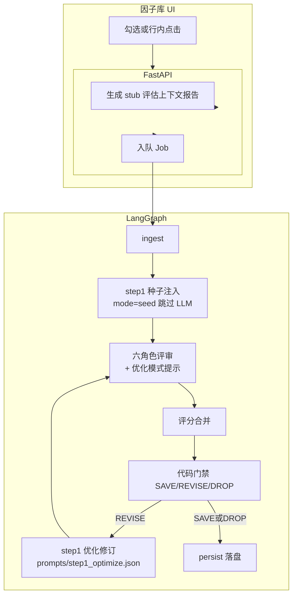

# 因子优化流程设计

> 本文描述当前研报因子提取系统中「因子优化」能力的端到端设计，对应已实现代码路径（LangGraph + FastAPI + Vue）。

## 1. 背景与目标

系统原有主链路是：**研报文本 → LLM 提取因子 → 六角色评审 → 门禁裁决 → 多轮修订 → 落盘**。

「因子优化」在此基础上增加一条旁路：用户从**因子库**（Alpha101 / 任务产出）勾选已有因子，**跳过研报提取**，将公式直接作为种子注入同一套 LLM 评估与修订流水线，用于：

- 对公开公式（如 Alpha101）做可实现性 / 稳健性再评估；
- 对历史任务产出的因子做二次优化与评分；
- 保留完整步骤时间线，便于对比修订前后。

## 2. 入口与产品交互

### 2.1 页面

- 前端：`frontend/src/views/FactorsView.vue`（菜单「因子库」）
- 两个 Tab：
  - **Alpha101**：分页读取 `GET /api/v1/factor-library/alpha101/factors`
  - **任务产出**：汇总最近成功任务的 `GET /api/v1/jobs/{id}/factors`

### 2.2 操作方式

| 入口 | 行为 |
|------|------|
| 工具栏「优化因子」 | 对当前勾选的多行批量创建评估任务 |
| 列表行内「优化因子」 | 仅优化该行单个因子 |

提交成功后跳转任务详情页：`/jobs/{job_id}`，复用步骤流图与因子结果表。

## 3. 总体架构



与「研报提取」任务共用同一张 LangGraph；差异在于：首轮 Step1 是否调用 LLM、修订/评审使用的提示词。

## 4. 提示词策略（关键）

优化任务**不能**与研报提取完全共用 Step1 提示词。研报提示词强调「忠实原文、禁止臆造研报没有的指标」；优化输入是公式种子 + stub 清单，共用会导致修订轮不敢改公式、或伪造研报引用。

### 4.1 分层策略

| 环节 | 提示词 | 策略 |
|------|--------|------|
| 首轮 Step1 | 无 | 种子注入，不调用 LLM |
| 六角色评审 | 复用 `step2_r*.json` | 运行时追加「因子库优化评估」说明（见下） |
| 修订轮 Step1 | **专用** `step1_optimize.json` | `meta.mode==evaluate` 时自动选用 |
| 门禁 | 代码规则 | 与研报任务共用阈值 |

### 4.2 专用修订提示词 `step1_optimize`

路径：`prompts/step1_optimize.json`  
注册：`prompts/index.json`、`PROMPT_KEYS`（可在「提示词」页查看/覆盖）  
加载：`step1_runtime_prompt("step1_optimize")` → `run_step1_extract` 在 `mode=evaluate` 时选用

设计要点：

- 目标：按评语做工程化优化（可算性、口径、中性化、稳健性）
- 明确输入**不是研报**；禁止伪造研报引用
- 动作：`REFINE` / `REPLACE` / `SPLIT` / `KEEP_WITH_EVIDENCE` / `DOWNGRADE`
- 输出 JSON 结构与 `step1_extract` 对齐，保证后续评审与落盘兼容
- user 模板中上下文标题为「评估上下文（因子库清单/说明，非研报原文）」

### 4.3 评审运行时追加说明

在 `agents._review_one_role_live` 中，当 `meta.mode==evaluate`：

- `mode` 模板变量改为 `library_optimize`
- system 追加：不要因缺少研报原文引用而否决/压分；suggestions 应给可落地方案

不改六个角色 JSON 文件，避免与研报评审互相干扰；提示词页仍可单独覆盖各角色。

### 4.4 时间线标识

| 轮次 | `payload.mode` | `prompt_ref` |
|------|----------------|--------------|
| 优化首轮 | `seed` | `null` |
| 优化修订 | `optimize_revise` | `prompts/step1_optimize.json` |
| 研报提取 | `extract` | `prompts/step1_extract.json` |
| 研报修订 | `revise` | `prompts/step1_extract.json` |

## 5. API 契约

### 5.1 创建优化任务

`POST /api/v1/jobs`

```json
{
  "mode": "evaluate",
  "title": "优化因子 · A001",
  "max_round": null,
  "factors": [
    {
      "factor_id": "A001",
      "name_zh": "Alpha101 #1",
      "name_en": "Alpha#1",
      "category": "Alpha101",
      "formula_or_rule": "(rank(...)-0.5)",
      "inputs": ["returns", "close"],
      "source": "Kakushadze, 2016"
    }
  ]
}
```

规则：

- `mode == "evaluate"` 或传入非空 `factors` 时进入评估模式；
- 必须提供至少一个带 `formula_or_rule` 的因子；
- 若无 `report_id` / `content`，后端自动生成 stub 报告（公式清单说明），保证 ingest / 修订轮仍有 `report_id`；
- `job.meta` 写入：`mode=evaluate`、`seed_factors=[...]`；
- 默认标题：`优化因子 · N 个`。

实现位置：

- 模型：`backend/factor_backend/models/schemas.py`（`SeedFactorIn` / `JobCreate`）
- 路由：`backend/factor_backend/api/routes_jobs.py`

### 5.2 因子库只读 API（数据来源）

| 方法 | 路径 | 说明 |
|------|------|------|
| GET | `/api/v1/factor-library/packs` | 包列表（当前含 alpha101） |
| GET | `/api/v1/factor-library/{pack_id}/factors` | 分页 / 搜索 |

数据文件：`data/factor_library/alpha101.json`。

## 6. 流水线节点设计

图定义见 `backend/factor_backend/graph/build.py`：

```
START → ingest → step1 → (review | persist)
     → review_fanout → review_merge → code_gate
     → (revise → step1 | persist) → END
```

### 6.1 ingest

加载 stub 报告文本与标题；初始化 `revise_packet=None`、`frozen={}`。

### 6.2 step1（关键分支）

实现：`backend/factor_backend/graph/nodes.py` → `node_step1`  
LLM 调用：`backend/factor_backend/services/agents.py` → `run_step1_extract`

| 条件 | 行为 |
|------|------|
| `meta.mode=="evaluate"` 且无 `revise_packet`（首轮） | **种子短路**：映射 `seed_factors`，不调用 LLM；`mode=seed` |
| `meta.mode=="evaluate"` 且有 `revise_packet` | LLM 修订，提示词 **`step1_optimize`**；`mode=optimize_revise` |
| 普通 extract / 研报修订 | LLM，提示词 **`step1_extract`** |

种子映射要点（避免评审「缺少公式」一票否决）：

```text
formula_or_rule  → definition.formula_or_rule
inputs           → definition.inputs
name_zh / category / source → 顶层字段
status           → NEW
```

### 6.3 六角色并行评审（step2）

角色定义见 `backend/factor_backend/services/reviewers.py`。对每个非 FROZEN 因子输出分项分、`comment` / `suggestions`、`veto`。优化模式下附加 §4.3 说明。

### 6.4 评分合并

`merge_scorecards`：修订轮可增量合并历史分卡。

### 6.5 代码门禁（step3）

`decide_action`（`backend/factor_backend/services/router_logic.py`）：

| 条件 | 动作 |
|------|------|
| 均分 ≥ `save_mean_min`（默认 80）且中位分 ≥ `save_median_min`（默认 75）且无 veto | **SAVE** → 冻结 |
| 未过线且 `round < max_round` | **REVISE** → 生成 `revise_packet` 回 step1 |
| 否则 | **DROP** |

### 6.6 persist

将 SAVE 因子写成结果包；`formula_or_rule` 从 `definition` 抽出；兼容字符串型 `definition` 与顶层 `name` 字段。

## 7. 与「研报提取」任务的对比

| 维度 | 研报提取 | 因子优化（evaluate） |
|------|----------|----------------------|
| 输入 | 研报 PDF/文本 | 因子库勾选的公式种子 |
| 首轮 Step1 | LLM + `step1_extract` | 种子注入（无 LLM） |
| 评审 | `step2_r*` | 同文件 + 优化模式 system 追加 |
| 修订轮 Step1 | `step1_extract` | **`step1_optimize`** |
| 时间线 mode | `extract` / `revise` | `seed` / `optimize_revise` |
| 前端入口 | 研报分析页 | 因子库工具栏 + 行内按钮 |

## 8. 前端实现要点

- API：`createJobEvaluate`（`frontend/src/api/client.ts`）
- 多选：`n-data-table` `type: 'selection'` + `checked-row-keys`
- 行内操作列：固定右侧「优化因子」文字按钮
- 缺少 `formula_or_rule` 的行会提示并拒绝提交
- 提示词管理页可编辑 `step1_optimize`（与 `step1_extract` 并列）

## 9. 数据流示意（单因子优化）

```text
用户点击「优化因子」
  → POST /jobs { mode:evaluate, factors:[A001...] }
  → 写入 stub 报告 + meta.seed_factors
  → Worker 拉起 LangGraph
  → ingest
  → step1 seed（A001 注入，无 LLM）
  → 六角色评审（library_optimize 提示）→ 合并 → 门禁
      ├─ SAVE → persist
      ├─ REVISE → step1 + step1_optimize.json → 再评审…
      └─ DROP → persist（淘汰列表）
```

## 10. 配置与运维

- 默认 `max_round`、门禁阈值来自 settings / `config/default.yaml`
- LLM：`openai` / `anthropic` / `cursor`；`AUTH_DISABLED` 本地可关鉴权
- 本地常用：后端 `18081`，前端 `5174`（Vite 代理 `/api`）
- 修改优化修订策略：编辑 `prompts/step1_optimize.json` 或在 UI「提示词」中覆盖后重置

## 11. 已知边界与后续可演进

1. **修订上下文**：仍基于 stub 清单而非真实研报；深度「对照原文」属研报提取场景。
2. **因子库写回**：优化结果落在任务结果中，尚未自动回写 Alpha101 JSON。
3. **批量上限**：未限制勾选数量；大批量会放大 LLM 成本。
4. **跨页勾选**：Alpha101 翻页会清理不在本页的勾选。
5. **角色提示词**：目前用运行时追加；若优化评分维度需大改，可再拆 `step2_*_optimize` 专用包。

## 12. 关键代码索引

| 模块 | 路径 |
|------|------|
| 优化修订提示词 | `prompts/step1_optimize.json` |
| 提示词索引 | `prompts/index.json` |
| 提示词加载 / PROMPT_KEYS | `backend/factor_backend/services/prompt_config.py` |
| Step1 / 评审 LLM 调度 | `backend/factor_backend/services/agents.py` |
| 创建任务 / stub 报告 | `backend/factor_backend/api/routes_jobs.py` |
| 种子短路 / 步骤记录 | `backend/factor_backend/graph/nodes.py` |
| 图编排 | `backend/factor_backend/graph/build.py` |
| 门禁规则 | `backend/factor_backend/services/router_logic.py` |
| 因子库服务 | `backend/factor_backend/services/factor_library.py` |
| 因子库页 | `frontend/src/views/FactorsView.vue` |
| Alpha101 数据 | `data/factor_library/alpha101.json` |
